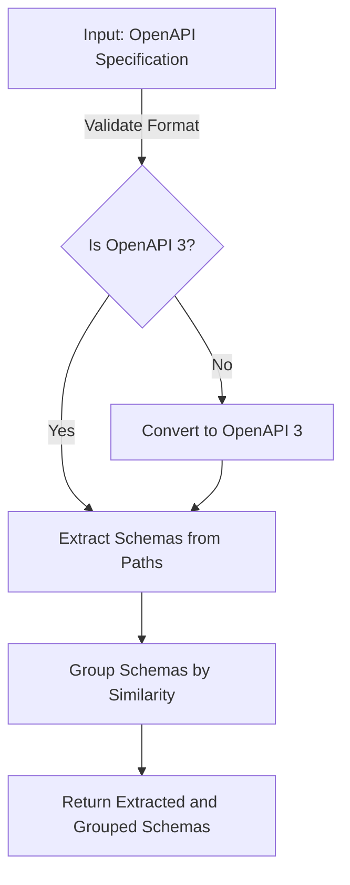

# API Metrics Analysis and Schema Extraction

This document provides a comprehensive explanation of the process for extracting schemas, computing various metrics, and using the two scripts: `structureAndDatamodelMetrics.js` and `naturalLanguageMetrics.js`.

---

## Overview

The two scripts provided analyze OpenAPI specifications to extract schemas, compute metrics, and provide insights into API structures and natural language documentation quality:

1. **`structureAndDatamodelMetrics.js`**:
   - Focuses on structural metrics, schema grouping, and data model analysis.
   - Computes metrics related to paths, operations, schemas, and their properties.

2. **`naturalLanguageMetrics.js`**:
   - Analyzes natural language in API descriptions and summaries.
   - Computes metrics for description coverage, readability, and verbosity.

Both scripts use the **schema extraction helpers** located in `utils/schema-utils.js`. These helpers handle the process of extracting and grouping schemas from the OpenAPI specification.

Before running the scripts, ensure all required dependencies are installed using `npm install`.

---

## Why Extract Schemas This Way?

1. **Schemas Are Not Always in Dedicated Sections**:
   - Schemas are often defined in `components.schemas` (OpenAPI 3) or `definitions` (OpenAPI 2), but this is not always the case.
   - Inline schemas in `requestBody` or `responses` fields are also extracted to ensure complete coverage.

2. **Standardized Processing**:
   - Converts legacy OpenAPI 2 specifications to OpenAPI 3 for consistent handling of schemas and structures.

3. **Schema Deduplication and Grouping**:
   - Identifies similar schemas across endpoints using `json-schema-compare` to reduce redundancy and enhance analysis.

4. **Context Retention**:
   - Maintains endpoint information (e.g., paths, methods) alongside schemas to trace their usage in the API.

---

## Schema Extraction Helpers

### Location

The schema extraction helpers are implemented in `utils/schema-utils.js`. These functions are used by both `structureAndDatamodelMetrics.js` and `naturalLanguageMetrics.js`.

### Key Functions

1. **`extractSchemas`**:
   - Extracts request and response schemas from an OpenAPI specification.
   - Handles schemas defined inline as well as in `components.schemas` or `definitions`.
   - Converts OpenAPI 2 specifications to OpenAPI 3 if necessary.

2. **`groupBySchema`**:
   - Groups similar schemas to reduce redundancy.
   - Uses the `json-schema-compare` library to identify structurally similar schemas.

3. **`convert2V3` and `convert2V3_2`**:
   - Convert OpenAPI 2 specifications to OpenAPI 3 for consistent processing.

### Workflow for Schema Extraction

---

## Metrics Documentation

### **Structural Metrics (Computed by `structureAndDatamodelMetrics.js`)**

| Metric                  | Description                                                                                  | Formula/Details                                                                 |
|-------------------------|----------------------------------------------------------------------------------------------|---------------------------------------------------------------------------------|
| **Paths**               | Total number of unique API paths in the specification.                                       | Count of keys in `paths`.                                                       |
| **Operations**          | Total number of operations (HTTP methods) defined across all paths.                          | Count of all HTTP methods in `paths`.                                           |
| **Webhooks**            | Total number of webhooks defined in the specification.                                       | Count of keys in `webhooks`.                                                    |
| **Used Methods**        | Number of unique HTTP methods used in the API.                                               | Unique set of HTTP methods (`GET`, `POST`, etc.).                               |
| **Parametered Operations** | Number of operations that define parameters.                                               | Count of operations with non-empty `parameters`.                                |
| **Distinct Parameters** | Unique parameter names across all operations.                                                | Extract and deduplicate parameter names from `parameters`.                      |
| **Parameters Per Operation** | Average number of parameters per operation.                                               | `(Total parameters) / (Total operations)`                                       |
| **Used Parameters**     | Total number of parameters used across all operations.                                       | Count of all parameter objects.                                                 |
| **Schemas**             | Total number of schemas extracted from the API.                                              | Count of grouped schemas after deduplication.                                   |
| **Defined Schemas**     | Number of schemas explicitly defined in `components.schemas` or `definitions`.               | Count of keys in `components.schemas` or `definitions`.                         |
| **Properties**          | Total number of properties across all schemas.                                               | Sum of all properties in extracted schemas.                                     |
| **Max Properties**      | Maximum number of properties in a single schema.                                             | Maximum property count among all schemas.                                       |
| **Min Properties**      | Minimum number of properties in a schema (if no properties exist, the value is set to `0`).  | Minimum property count among all schemas.                                       |
| **Distinct Properties** | Unique property names across all schemas.                                                    | Deduplicated set of property names from all schemas.                            |

---

### **Natural Language Metrics (Computed by `naturalLanguageMetrics.js`)**

| Metric                               | Description                                                                                  | Formula/Details                                                                                     |
|--------------------------------------|----------------------------------------------------------------------------------------------|-----------------------------------------------------------------------------------------------------|
| **Endpoints Description Coverage**   | Proportion of endpoints with descriptions or summaries.                                       | `(Described endpoints) / (Total HTTP methods)`                                                     |
| **Description Sizes**                | Array of word counts for descriptions and summaries of each endpoint.                        | Count of words in `description` and `summary` fields.                                              |
| **Average Sentences Per 100 Words**  | Average number of sentences per 100 words.                                                   | `(Sentence count / Word count) * 100`                                                              |
| **Average Characters Per 100 Words** | Average number of characters per 100 words.                                                  | `(Character count / Word count) * 100`                                                             |
| **Coleman-Liau Index**               | A readability score indicating the complexity of the documentation.                          | `0.0588 * charPer100 - 0.296 * sentPer100 - 15.8`                                                   |
| **Automated Readability Index**      | Another readability metric based on word and sentence length.                                | `4.71 * charPerWord + 0.5 * wordsPerSentence - 21.43`                                               |
| **Average Words Per Sentence**       | Average number of words per sentence.                                                        | `(Total words in all descriptions) / (Total sentences in all descriptions)`                        |
| **Average Characters Per Word**      | Average number of characters per word.                                                       | `(Total characters in all descriptions) / (Total words in all descriptions)`                       |